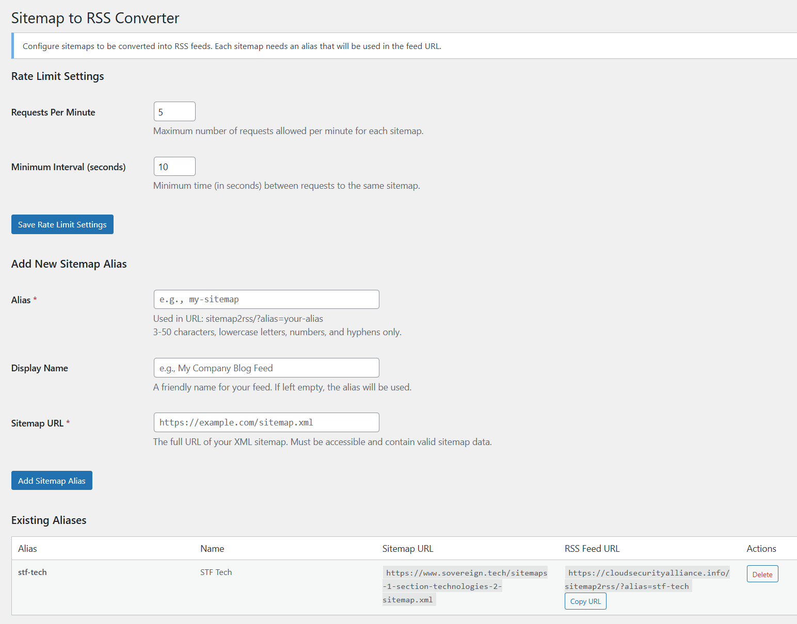
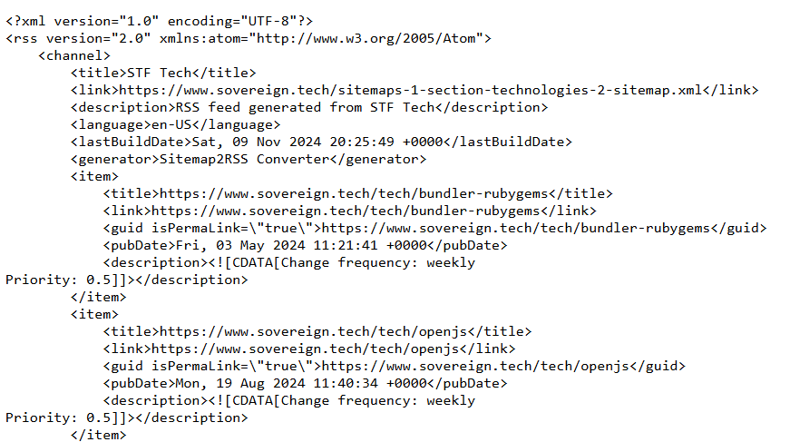

# Sitemap to RSS Converter

* Contributors: kurtseifried
* Tags: sitemap, rss, feed, converter, xml
* Requires at least: 5.0
* Tested up to: 6.4
* Stable tag: 1.0.5
* Requires PHP: 7.2
* License: GPLv2 or later
* License URI: https://www.gnu.org/licenses/gpl-2.0.html

Convert XML sitemaps into RSS feeds and access them.

## Description 

Sitemap to RSS Converter allows you to transform XML sitemaps into RSS feeds using predefined aliases. This is particularly useful for monitoring updates to websites that only provide sitemaps but no RSS feeds. This was inspired by the STF (Sovereign Tech Fund) which has great sitemap.xml files for their web site but the RSS feed only covers the front page and not the tech pages. This plugin was Written with Claude Sonnet 3.5.

Features:

* Create aliases for your sites that have sitemaps but no RSS feed
* Simple and clean admin interface
* Secure by design - only approved sitemaps can be converted
* Easy to use and maintain

## Installation

1. Upload the plugin files to the `/wp-content/plugins/sitemap-to-rss` directory, or install the plugin through the WordPress plugins screen directly.
2. Activate the plugin through the 'Plugins' screen in WordPress
3. Use the Settings->Sitemap to RSS screen to add your sitemap aliases
4. Access your feeds using your-site.com/sitemap2rss/?alias=your-alias

## Frequently Asked Questions 

### How do I create a new RSS feed? 

1. Go to Settings->Sitemap to RSS in your WordPress admin
2. Add a new sitemap with an alias and URL
3. Access your feed at your-site.com/sitemap2rss/?alias=your-alias

### Can I convert any sitemap to RSS?

For security reasons, sitemaps must be pre-configured through the admin interface before they can be accessed as RSS feeds. You can also use long aliases effectively as API keys, please note that they will show up in the web server logs however.

### Screenshots

1. Admin interface for managing sitemap aliases
2. Example of RSS output

